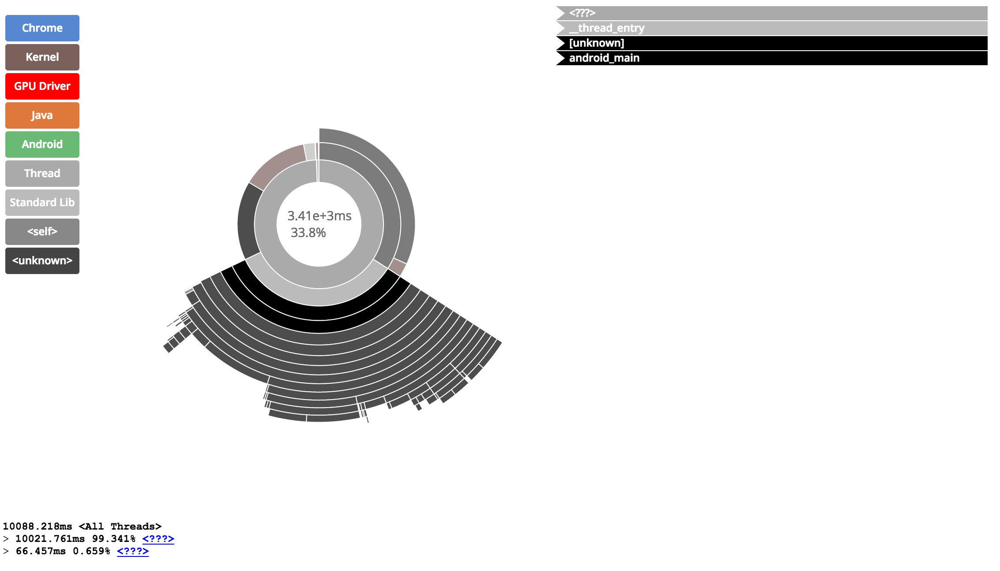

android_ndk_perf    {#android_ndk_perf}
================

[android_ndk_perf][] is a desktop tool that enables native (C/C++)
developers to measure the CPU utilization of their applications on
[Android][], guiding their optimization efforts.

[android_ndk_perf][] uses [Linux Perf][] to profile the native (C/C++)
components of applications on Android.  [android_ndk_perf][] can be
run on developer's workstations to collect traces of applications running on
Android devices.  After application traces are collected the data can be
examined using [Linux Perf][]'s commands or a HTML visualization can be
generated for inspection in a web browser.

Examples in the following sections reference the [LiquidFun][] Testbed
application as it's moderately complex and provides interesting traces.

In order to use this tool, all [prerequisites](@ref fplutil_prerequisites)
should be installed.

**NOTE:** At the moment perfhost binaries are only provided for Linux and OSX.
Windows is not yet supported!

# Sampling vs. Intrusive Profiling    {#android_ndk_perf_sampling}

[Linux Perf][] is a sampling profiler that by default will sample the
location of the instruction pointer at 1KHz.  The tool can be used to configure
the perf events subsystem in the Linux kernel to sample a wide variety of
counters in the system.

Sampling profilers like [Linux Perf][] are very good at providing a broad
overview of application performance with very low overhead.  [Linux Perf][]
is a great tool to determine where time is being spent in an application over
a relatively long period of time (e.g seconds).

By constrast, intrusive profilers - where an application is instrumented with
timing code - can be more effective at very quickly and accurately
determining the overhead of small functions in an application.  For example,
when optimizing a small function it may be quicker to use an intrusive
profiler to measure the number of cycles, cache misses, branch mispredicts
etc. in a section of code rather than running the function over a long period
of time with a high frequency sampling profiler like [Linux Perf][].

# Building Applications for Profiling    {#android_ndk_perf_building}

Application to be profiled must be:
   * Built as [debuggable APK][] (It's still possible to package release
     executables in a debuggable APK).
   * Compiled with symbols making it possible to convert instruction pointers
     in stack traces to function names.
   * If the target ABI is ARM the application should be compiled with
     the `-mapcs-frame`
     [option](http://gcc.gnu.org/onlinedocs/gcc/ARM-Options.html) so that
     stack frames are compliant with the ARM Procedure Call Standard.  This
     makes it possible for [Linux Perf][] to correctly add symbolic function
     names to instruction pointers in traces.

## Building and Installing using build_all_android    {#android_ndk_perf_building_fplutil}

If you're building using fplutil's [build_all_android][], the process of
building and installing [LiquidFun][]'s Testbed application with symbols for
ARM (v7a) can be performed using the following command:

~~~{.sh}
    cd liquidfun/Box2D/Testbed
    build_all_android -E dependencies -f 'NDK_DEBUG=0 APP_ABI=armeabi-v7a APP_CFLAGS=-mapcs-frame' -T debug -i
~~~

## Building using ndk-build and ant    {#android_ndk_perf_building_manual}

`ndk-build` can be used to build [LiquidFun][] Testbed application with
symbols for ARM (v7a) with the following commands:

~~~{.sh}
    cd liquidfun/Box2D/Testbed
    ndk-build NDK_DEBUG=0 APP_ABI=armeabi-v7a APP_CFLAGS=-mapcs-frame
~~~

After building the application's native components it needs to be packaged in
a [debuggable APK][]:

~~~{.sh}
    cd liquidfun/Box2D/Testbed
    android update project --target android-15 -n testbed --path .
    ant debug
~~~

Finally, the application should be installed on a test device:

~~~{.sh}
    cd liquidfun/Box2D/Testbed
    adb install bin/testbed-debug.apk
~~~

# Capturing a Trace    {#android_ndk_perf_record}

After installing an application on a device, it's possible to capture a
trace to the directory `output/perf.data` using [android_ndk_perf][]'s
`record` command:

~~~{.sh}
    cd liquidfun/Box2D/Testbed
    android_ndk_perf --apk bin/testbed-debug.apk record -o output/perf.data
~~~

To stop the trace press `Ctrl-C` (sends the interrupt signal to the process).

The `record` command performs the following:
   * Launches the main intent of the package specified by the
     `bin/testbed-debug.apk`.
   * Starts [Linux Perf][] on the device.
   * Ctrl-C stops [Linux Perf][] and the application.
   * Copies the trace from the device to `output/perf.data`
   * Copies objects referenced from the device to the `output/` directory.

# Visualizing a Trace    {#android_ndk_perf_visualize}

[android_ndk_perf][]'s `visualize` command can be used to generate a
HTML report and open the report in a web browser.  The trace
`output/perf.data` captured using the `record` command can be converted
to the HTML report `report.html` and viewed using the following command:

~~~{.sh}
    cd liquidfun/Box2D/Testbed
    android_ndk_perf visualize -i output/perf.data -o report.html
~~~

Which generates a [report][] like the following:

The multi-colored box on the left is a legend that very roughly classifies
a subset of objects profiled:

The center of the [report][] is populated by a chart which contains concentric
rings where each ring represents a level of the stack from the entry point of
the application at the center out to the leaf functions on the outside of the
chart.  The top number in the center of the chart describes the total time
used by the function highlighted by the mouse pointer on the chart.  The lower
number provides the percentage of the time the function was called for over the
profiling period.

When a ring is highlighted in the chart, the stack trace of visible functions
in the chart are shown on the top right side of the screen:

Finally, the stack for the currently selected function is shown along with the
percent of time spent in each function on the bottom left of the screen:

An example [report][] generated from a profile of [LiquidFun][]'s Testbed
application, captured on a Nexus 5, is available to browse [here](report.html).

# Trace Reports    {#android_ndk_perf_report}

[Linux Perf][] provides the `report` command to view a `perf.data` trace file.
This command can be invoked via [android_ndk_perf][] using the following:

~~~{.sh}
    cd liquidfun/Box2D/Testbed
    android_ndk_perf report -i output/perf.data
~~~

`report` provides a view similar to the `visualize` command's output with a
tree view showing a call graph hierarchy and the percentage of time spent in
each function down the graph.

A more terse overview of the data can be retrieved using:

~~~{.sh}
    cd liquidfun/Box2D/Testbed
    android_ndk_perf report -i output/perf.data --call-graph none
~~~

Which will produce something like the following, summarizing the amount of
time spent in each function over the profiling period:
~~~
    # Events: 4K cpu-clock
    #
    # Overhead  Command     Shared Object           Symbol
    # ........  ..........  ......................  ......
    #
        13.42%  GL updater  libqdutils.so           [.] 0xc03a8 
         3.67%  GL updater  libqdutils.so           [.] b2ParticleSystem::InsideBoundsEnumerator::GetNext()
         3.22%  GL updater  libqdutils.so           [.] 0x5fe00 
         2.77%  GL updater  libqdutils.so           [.] 0x12f24 
         2.64%  GL updater  libqdutils.so           [.] b2PolygonShape::ComputeDistance(b2Transform const&, b2Vec2 const&, float*, b2Vec2*, int) const
~~~

 

  [Android]: http://www.android.com
  [android_ndk_perf]: @ref android_ndk_perf
  [build_all_android]: @ref build_all_android
  [Linux Perf]: http://perf.wiki.kernel.org
  [LiquidFun]: http://google.github.io/liquidfun/
  [debuggable APK]: http://developer.android.com/guide/topics/manifest/application-element.html#debug
  [report]: report.html
